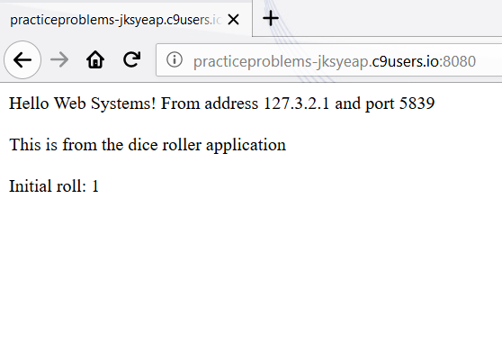
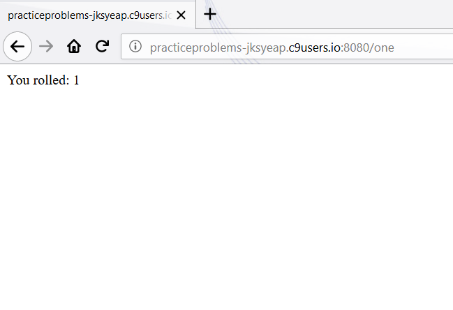
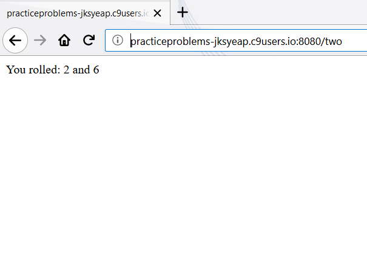
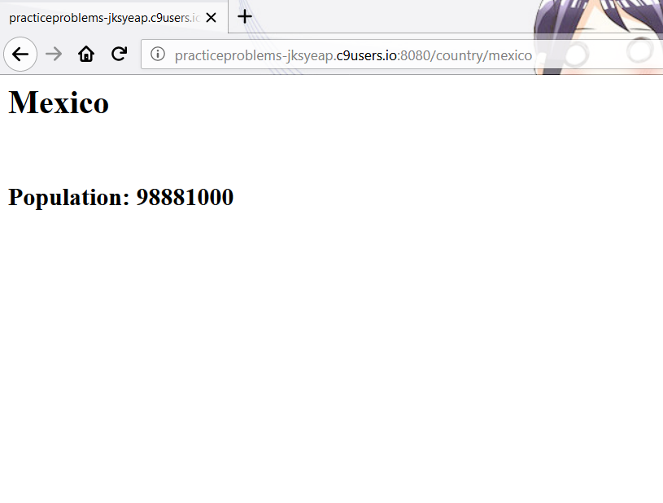
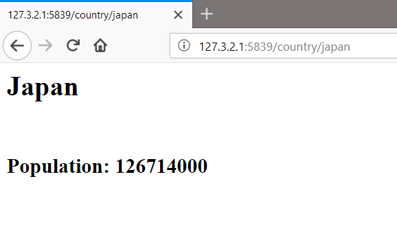
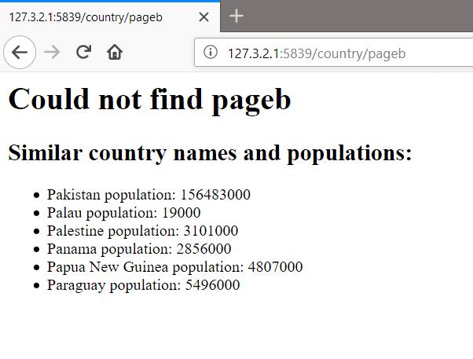

# Question 1

## (a) Simple Response
Output for a request to http://www.grotto-networking.com:  
Status: OK  
Status code: 200  
request: {"uri":{"protocol":"http:","slashes":true,"auth":null,"host":"www.grotto-networking.com","port":80,"hostname":"www.grotto-networking.com","hash":null,"search":null,"query":null,"pathname":"/patents.html","path":"/patents.html","href":"http://www.grotto-networking.com/patents.html"},"method":"GET","headers":{}}  
HTTP version: 1.1  
trailers: {}  
server = nginx  
date = Fri, 05 Oct 2018 23:31:15 GMT  
content-type = text/html  
content-length = 21853  
connection = close  
vary = Accept-Encoding  
last-modified = Tue, 14 Aug 2018 16:37:42 GMT  
etag = "555d-57367d42f910c"  
accept-ranges = bytes  
body size: 21853  

```
// loop for printing response.headers object
for(let header in response.headers)
  console.log(header + " = " + response.headers[header]);
  
// changed request to the patents page
request.get("http://www.grotto-networking.com/patents.html",
    function(error, response, body){
    if (error) {
        console.log('error:', error);
        return;
    };
    lookAtResponse(response);
    lookAtBody(body);
    console.log("\n\n\n");
});
```

## (b) Bad Response I
Status: Not Found  
Status code: 404  
request: {"uri":{"protocol":"http:","slashes":true,"auth":null,"host":"www.grotto-networking.com","port":80,"hostname":"www.grotto-networking.com","hash":null,"search":null,"query":null,"pathname":"/hiClass.html","path":"/hiClass.html","href":"http://www.grotto-networking.com/hiClass.html"},"method":"GET","headers":{}}  
HTTP version: 1.1  
trailers: {}  
server = nginx  
date = Fri, 05 Oct 2018 23:40:34 GMT  
content-type = text/html; charset=iso-8859-1  
content-length = 210  
connection = close  
vary = Accept-Encoding  
body size: 210  

This is the expected code (404) for a page that doesn't exist

## (c) Bad Response II

## (d) JSON Response
content-type header says it is application/json  
In entry 35 the distance was 28.3  
The whole output for this request is:  

Status: OK  
Status code: 200  
request: {"uri":{"protocol":"https:","slashes":true,"auth":null,"host":"windsurf.grotto-networking.com","port":443,"hostname":"windsurf.grotto-networking.com","hash":null,"search":null,"query":null,"pathname":"/data/logs/windEvents2018.json","path":"/data/logs/windEvents2018.json","href":"https://windsurf.grotto-networking.com/data/logs/windEvents2018.json"},"method":"GET","headers":{}}  
HTTP version: 1.1  
trailers: {}  
server = nginx  
date = Sun, 07 Oct 2018 02:08:20 GMT  
content-type = application/json  
content-length = 32611  
connection = close  
last-modified = Sat, 06 Oct 2018 17:30:30 GMT  
etag = "7f63-57792bea261ee"  
accept-ranges = bytes  
body size: 32611  
{ start: 1530046491,  
  max2sec: 23.75,  
  board: 'FoilT-80',  
  max10sec: 23.29,  
  desc: 'Started reasonably windy then dropped when I hit the water.  Was able to get out and up with some slogging in between tacks.  Found good wind up near Treasure Island. Had two trips up. Big waves. Under powered at times but overall good day.',  
  sail: '6.6',  
  location: 'Berkeley',  
  distance: 28.3,  
  end: 1530055460 }  
  
# Question 2

---

---


# Question 3

---

---
