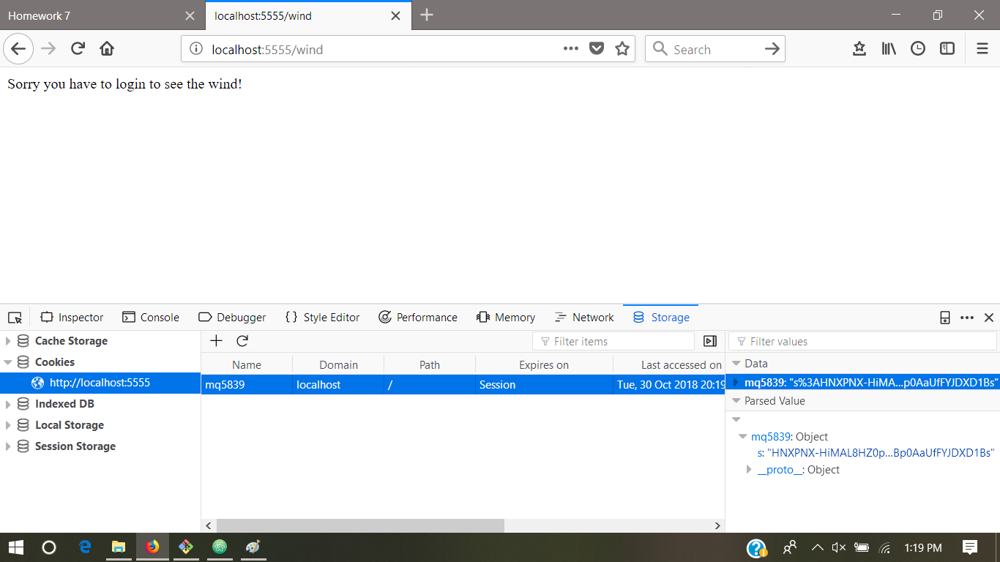

# Question 1

## (a) Asynchronous Javascript
The output will be:

myTime = 1, elapsedTime = 1.0  
myTime = 2, elapsedTime = 1.0  
myTime = 3, elapsedTime = 1.0  
myTime = 4, elapsedTime = 1.0  

This is because the four calls to setTimeout will only add four instances of   
advanceTime to the event queue at nearly the same time, without any pause in  
between. Then after waiting for one second, each instance of advanceTime runs   
one after another, quickly enough that it looks like they all ran at the same   
time.    

## (b) Promises, Promises
The output for this code was:

myTime = 1, elapsedTime = 0  
myTime = 2, elapsedTime = 0.002  
myTime = 3, elapsedTime = 0.002  
myTime = 4, elapsedTime = 0.002  

This still doesn't work correctly because the elapsed time is not increasing  
by 1 second like it is supposed to. The mistake here is that the promises were  
not chained in any way. You just have four calls to advanceTime that will run  
consecutively. Each advanceTime instance returns a promise, but the next  
instance of advanceTime is not waiting for that promise to resolve. You could  
fix this by chaining:  
```
oneSecond()
  .then(advanceTime)
  .then(advanceTime)
  .then(advanceTime)
  .then(advanceTime);
```  

## (c) Requests in Series with Promises
The modified code is:
```
const rp = require('request-promise-native');
let site1 = {
    uri: 'https://www.youtube.com',
    method: 'HEAD', // What does this do?
    resolveWithFullResponse: true
};

let site2 = {
    uri: 'https://www.bbc.com/news',
    method: 'HEAD',
    resolveWithFullResponse: true
};

let site3 = {
    uri: 'https://www.nst.com.my',
    method: 'HEAD',
    resolveWithFullResponse: true
};

let start = new Date();
rp(site1).then(res => {
    let time = (new Date() - start)/1000;
    console.log(`YouTube status: ${res.statusCode}, time: ${time}`);
    return rp(site2);
}).then(res => {
    let time = (new Date() - start)/1000;
    console.log(`BBC News status: ${res.statusCode}, time: ${time}`);
    return rp(site3);
}).then(res => {
    let time = (new Date() - start)/1000;
    console.log(`New Straits Times status: ${res.statusCode}, time: ${time}`);
})
console.log("Starting my web requests:");
```

The output is: 
  
Starting my web requests:  
YouTube status: 200, time: 1.254  
BBC News status: 200, time: 1.31  
New Straits Times status: 200, time: 1.731  
  
The main advantage of using promises in this case is that you can guarantee the  
order in which these sites are visited. 

## (d) Requests in Parallel with Promises
The modified code is:
```
const rp = require('request-promise-native');
let site1 = {
    uri: 'https://www.youtube.com',
    method: 'HEAD', // What does this do?
    resolveWithFullResponse: true
};

let site2 = {
    uri: 'https://www.bbc.com/news',
    method: 'HEAD',
    resolveWithFullResponse: true
};

let site3 = {
    uri: 'https://www.nst.com.my',
    method: 'HEAD',
    resolveWithFullResponse: true
};

let start = new Date();
let p1 = rp(site1).then(res => {
    let time = (new Date() - start)/1000;
    return console.log(`YouTube status: ${res.statusCode}, time: ${time}`);});

let p2 = rp(site2).then(res => {
    let time = (new Date() - start)/1000;
    return console.log(`BBC News status: ${res.statusCode}, time: ${time}`);
});

let p3 = rp(site3).then(res => {
    let time = (new Date() - start)/1000;
    return console.log(`New Straits Times status: ${res.statusCode}, time: ${time}`);
});

console.log("Starting my web requests:");
Promise.all([p1, p2, p3]).then(x=>{
    console.log("All Finished");
});
```

The output is:

Starting my web requests:  
BBC News status: 200, time: 0.143  
New Straits Times status: 200, time: 0.44  
YouTube status: 200, time: 1.517  
All Finished  

The advantage here is that we might save some time running requests in parallel  
instead of having to wait for each request to finish before running the next.  
But now the order is not guaranteed. 

# Question 2

## (a) JSON Server and Database
```
app.put('/register', jsonencodedParser, function(req,res) {
  let user = req.body;
  db.find({"name": user.name}, function(err,docs) {
    if(err) 
      {console.log("database error");}
    else 
    {
      let response = {};
      if(docs.length == 0)
      {
        db.insert(user);
        response.registration = "succeeded";
        response.user = user.name;
        response.reason = undefined;
        res.send(JSON.stringify(response));
      }
      else
      {
        response.registration = "failed";
        response.user = user.name;
        response.reason = "user already exists";
        res.send(JSON.stringify(response));
      }
    }
  });
});
```

## (b) Test the "/register" path
Code:  
```
request.put({uri:"http://0.0.0.0:8080/register", json:true, body:{"name":"Owen", "nickname":"Vanilla"}}, function(error,response,body) {
  console.log(body);
});

request.put({uri:"http://0.0.0.0:8080/register", json:true, body:{"name":"Steve", "nickname":"Outback"}}, function(error,response,body) {
  console.log(body);
});

request.put({uri:"http://0.0.0.0:8080/register", json:true, body:{"name":"Pack", "nickname":"Half-Pint"}}, function(error,response,body) {
  console.log(body);
});

request.put({uri:"http://0.0.0.0:8080/register", json:true, body:{"name":"Danny", "nickname":"Doughboy"}}, function(error,response,body) {
  console.log(body);
});

request.put({uri:"http://0.0.0.0:8080/register", json:true, body:{"name":"Karen", "nickname":"Six Feet"}}, function(error,response,body) {
  console.log(body);
});
```

First run:  
{"registration":"succeeded","user":"Owen"}  
{"registration":"succeeded","user":"Steve"}  
{"registration":"succeeded","user":"Pack"}  
{"registration":"succeeded","user":"Danny"}  
{"registration":"succeeded","user":"Karen"}  

Second run:  
{"registration":"failed","user":"Owen","reason":"user already exists"}  
{"registration":"failed","user":"Steve","reason":"user already exists"}  
{"registration":"failed","user":"Pack","reason":"user already exists"}  
{"registration":"failed","user":"Danny","reason":"user already exists"}  
{"registration":"failed","user":"Karen","reason":"user already exists"}  

## (c) Add an "/allUsers" path and functionality
```
app.get('/allUsers', function(req,res) {
  let time = new Date();
  let response = {"date":time.toString()};
  db.find({}, function(err,docs) {
    if(err) 
      {console.log("database error");}
    else
    {
      let names = [];
      for(let doc of docs)
        names.push(doc.name);
      response.users = names;
      res.send(JSON.stringify(response));
    }
  });
});
```

## (d) Test the "/allUsers" path
Code:  
```
request.get("http://0.0.0.0:8080/allUsers", function(error,response,body) {
  console.log(body);
})
```

Output:  
{"date":"Mon Oct 22 2018 15:56:17 GMT-0700 (PDT)","users":["Danny","Karen","Pack","Steve","Owen"]}  

## (e) Nickname interface
```
app.get('/nickname', jsonencodedParser, function(req,res) {
  let query = req.body;
  console.log(query);
  db.find({"name": query.user}, function(err,docs) {
    if(err) 
      {console.log("database error");}
    else
    {
      let response = {};
      if(docs.length == 0)
      {
        response.user = query.user;
        response.error = "Not Found";
        res.send(JSON.stringify(response));
      }
      else
      {
        response.user = docs[0].name;
        response.nickname = docs[0].nickname;
        res.send(JSON.stringify(response));
      }
    }
  });
});
```

## (f) Test the Nickname interface
Code:  
```
request.get({uri:"http://0.0.0.0:8080/nickname", json:true, body:{"user":"Karen"}}, function(error,response,body) {
  console.log(body);
});

request.get({uri:"http://0.0.0.0:8080/nickname", json:true, body:{"user":"Danny"}}, function(error,response,body) {
  console.log(body);
});

request.get({uri:"http://0.0.0.0:8080/nickname", json:true, body:{"user":"Joe"}}, function(error,response,body) {
  console.log(body);
});
```

Output:  
{ user: 'Karen', nickname: 'Six Feet' }  
{ user: 'Danny', nickname: 'Doughboy' }  
{ user: 'Joe', error: 'Not Found' }  

# Question 3

## (a) The Cookies Path Attribute
In the "/" path the three cookies are sent. In the "/" path only the firstcookie  
is got back from the browser because it is the only one with the "/" path  
attribute. In the the "/left" path there are two cookies received from the   
browser: firstcookie and secondcookie. This is because they have path attributes  
that match the url (i.e. "/" and "/left"). In the "/right" path there are also  
only two cookies received: firstcookie and thirdcookie. Since "/" and "/right"  
match, the cookies with these path attributes are sent to the server.  

## (b) Cookies and the _Request_ Library
Output:  
Starting my web requests:  
Testing cookies, "/" path, client sent: {undefined}  
Testing cookies, "/left" path, client sent: {undefined}  
Testing cookies, "/right" path, client sent: {undefined}  

These results are different than part (a). This is because in _request_ cookies  
are not saved by default so no cookies are sent back to the server. In order to  
use cookies they need to be saved in a "jar" and the subsequent request calls  
need to be nested in the first call so that they share the same jar (I think).

## (c) Using Cookies with the _Request_ Library
Output:  
Starting my web requests:  
Testing cookies, "/" path, client sent: {undefined}  
Testing cookies, "/left" path, client sent: {secondcookie=leftcookie; firstcookie=midcookie}  
Testing cookies, "/right" path, client sent: {thirdcookie=rightcookie; firstcookie=midcookie}  
Testing cookies, "/" path, client sent: {firstcookie=midcookie}  

# Question 4

## (a) Password Authentication
Code for /register view:  
```
app.put('/register', jsonencodedParser, function(req,res) {
  let user = req.body;
  db.find({"name": user.name}, function(err,docs) {
    if(err) 
      {console.log("database error");}
    else 
    {
      let response = {};
      if(docs.length == 0)
      {
        argon2.hash(user.password).then(hash => {
          user.password = hash;
          db.insert(user);
          response.registration = "succeeded";
          response.user = user.name;
          response.reason = undefined;
          res.send(JSON.stringify(response));
        });
      }
      else
      {
        response.registration = "failed";
        response.user = user.name;
        response.reason = "user already exists";
        res.send(JSON.stringify(response));
      }
    }
  });
});
```

Database looks like this:  
{"name":"Owen","nickname":"Vanilla","password":"$argon2i$v=19$m=4096,t=3,p=1$fcdAxZkQ/295vQ0CxM7oIQ$yWtbTEBZ5Rdb6ahLFG7G3u0NLNP2Kqg+99giQlvB9Kk","\_id":"40uBvhHcYC6vQEp0"}  
{"name":"Danny","nickname":"Doughboy","password":"$argon2i$v=19$m=4096,t=3,p=1$vJlzsTQZyYzZOpPpixrRzQ$hAEiln/xugugzLtb1nYNGNrKiKJkgWRHF9f5rAALBt0","\_id":"6Dr9HbK8oM91S5A1"}  
{"name":"Pack","nickname":"Half-Pint","password":"$argon2i$v=19$m=4096,t=3,p=1$TuoF/8yMtgR2Xdaz9Twnhw$QLYtumIMkzhLTjjy3JJWKjdgJSGZhFZIDtghSftmlcA","\_id":"mzLCUtwtDHkGlTB9"}  
{"name":"Steve","nickname":"Outback","password":"$argon2i$v=19$m=4096,t=3,p=1$Xf8Dr7vaPjacQJNl7VuPlw$Wl8hZa6XziivCaYMEcUl9x5T7noUePQSZ8jeq/GO2mw","\_id":"7RXDeMdRaDfN9d25"}  
{"name":"Karen","nickname":"Six Feet","password":"$argon2i$v=19$m=4096,t=3,p=1$0vuQlzPiwUZUJnWv17Z1jA$IPpwq/MoXA+Oj9LZQtMtKLXXuc4WmBIipu+i8AZkzag","\_id":"i1K4qFz3VwBCOhbj"}  

## (b) Restricting Access to Interfaces
Code for the /allUsers view:  
```
app.get('/allUsers', jsonencodedParser, function(req,res) {
  let query = req.body;
  db.find({"name":query.Rname}, function(err,docs) {
    if(err)
      {console.log("database error");}
    else {
      if(docs.length == 0)
      {
        console.log("User not registered");
        res.send(JSON.stringify({"error":"User not registered"}));
      }
      else {
        argon2.verify(docs[0].password,query.Rpassword).then(match => {
          if(match) {
            let time = new Date();
            let response = {"date":time.toString()};
            db.find({}, function(err,docs) {
              if(err) 
                {console.log("database error");}
              else {
                let names = [];
                for(let doc of docs)
                  names.push(doc.name);
                response.users = names;
                res.send(JSON.stringify(response));
              }
            });
          }
          else
          {
            console.log("Incorrect Password");
            res.send(JSON.stringify({"error":"Incorrect Password"}));
          }
        });
      }
    }
  });
});
```

(i) nickname request with user name in the database:  
{ user: 'Karen', nickname: 'Six Feet' }  

(ii) nickname request with user name not in the database:  
{ user: 'Joe', error: 'User not found' }  

(iii) invalid nickname request with wrong password:  
{ Rname: 'Steve', error: 'Incorrect Password' }  

# Question 5

## (a) Changing the "session fingerprint"
  

## (b) Verify session ID changes on login
Before logging in:  
  
After logging in: 
  
Code:  
```        
let oldInfo = req.session.user;
req.session.regenerate(function(err) {
    req.session.user = Object.assign({}, oldInfo, {loggedin: true});
    res.send('You are logged in!');
});
```

## (c) Show access restrictions
Wind path:  
  
Wave path:


Code:  
```
if (req.session.user.loggedin) {
    req.session.user.windcount += 1;
    res.send(`Wind: wind count: ${req.session.user.windcount}`);
} else {
    res.send(`Sorry you have to login to see the wind!`);
}
```

## (d) Deleting cookies
  
It looks like to remove the cookie from the browser it deletes the session id value  
and it sets an expiration date.